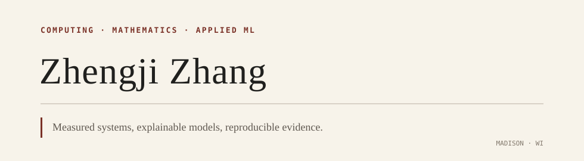

<picture>
  <source media="(prefers-color-scheme: dark)" srcset="assets/header-dark.svg">
  <source media="(prefers-color-scheme: light)" srcset="assets/header-light.svg">
  
</picture>

Computer Science & Mathematics at the **University of Wisconsin–Madison**.

I build machine learning systems, study model behavior, and turn experiments into usable tools. My work centers on reproducible evaluation, inference engineering, and quantitative research.

[Selected work](#selected-work) · [All repositories](https://github.com/Evihut?tab=repositories)

## Selected work

01 / ML SYSTEMS

### [MiniMind Systems →](https://github.com/Evihut/minimind-systems)

Engineering extensions built on MiniMind: static KV caching, dynamic request batching, and observable FastAPI serving. Reproducible CPU microbenchmarks compare cache and batching configurations while documenting their experimental limits.

*PyTorch · FastAPI · Static KV Cache · Dynamic Batching · Prometheus*

---

02 / APPLIED MACHINE LEARNING

### [Explainable ESG Risk & Reporting →](https://github.com/Evihut/esg-risk-reporting)

Company risk modeling with shared-fold evaluation, SHAP evidence, and a model-grounded reporting API. A fresh fixed-parameter evaluation records CatBoost OOF RMSE **4.870** against a training-fold mean baseline of **6.890** across 430 eligible companies.

*CatBoost · SHAP · scikit-learn · FastAPI*

**2025 Zhixiang Cup · Grand Prize / 特等奖** 
The award applies to the original competition case; the repository separately documents the subsequent engineering release.

## Focus

ML systems · Applied mathematics · Interpretable modeling · Data science · Quantitative research
