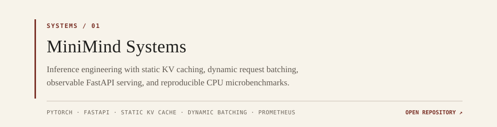
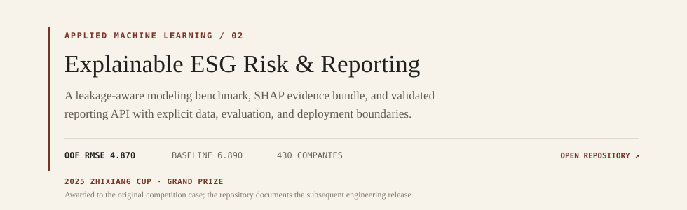
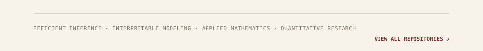

<picture>
  <source media="(prefers-color-scheme: dark)" srcset="assets/header-dark.svg">
  <source media="(prefers-color-scheme: light)" srcset="assets/header-light.svg">
  
</picture>

<a href="https://github.com/Evihut/minimind-systems">
  <picture>
    <source media="(prefers-color-scheme: dark)" srcset="assets/minimind-dark.svg">
    <source media="(prefers-color-scheme: light)" srcset="assets/minimind-light.svg">
    
  </picture>
</a>

<a href="https://github.com/Evihut/esg-risk-reporting">
  <picture>
    <source media="(prefers-color-scheme: dark)" srcset="assets/esg-dark.svg">
    <source media="(prefers-color-scheme: light)" srcset="assets/esg-light.svg">
    
  </picture>
</a>

<a href="https://github.com/Evihut?tab=repositories">
  <picture>
    <source media="(prefers-color-scheme: dark)" srcset="assets/footer-dark.svg">
    <source media="(prefers-color-scheme: light)" srcset="assets/footer-light.svg">
    
  </picture>
</a>
